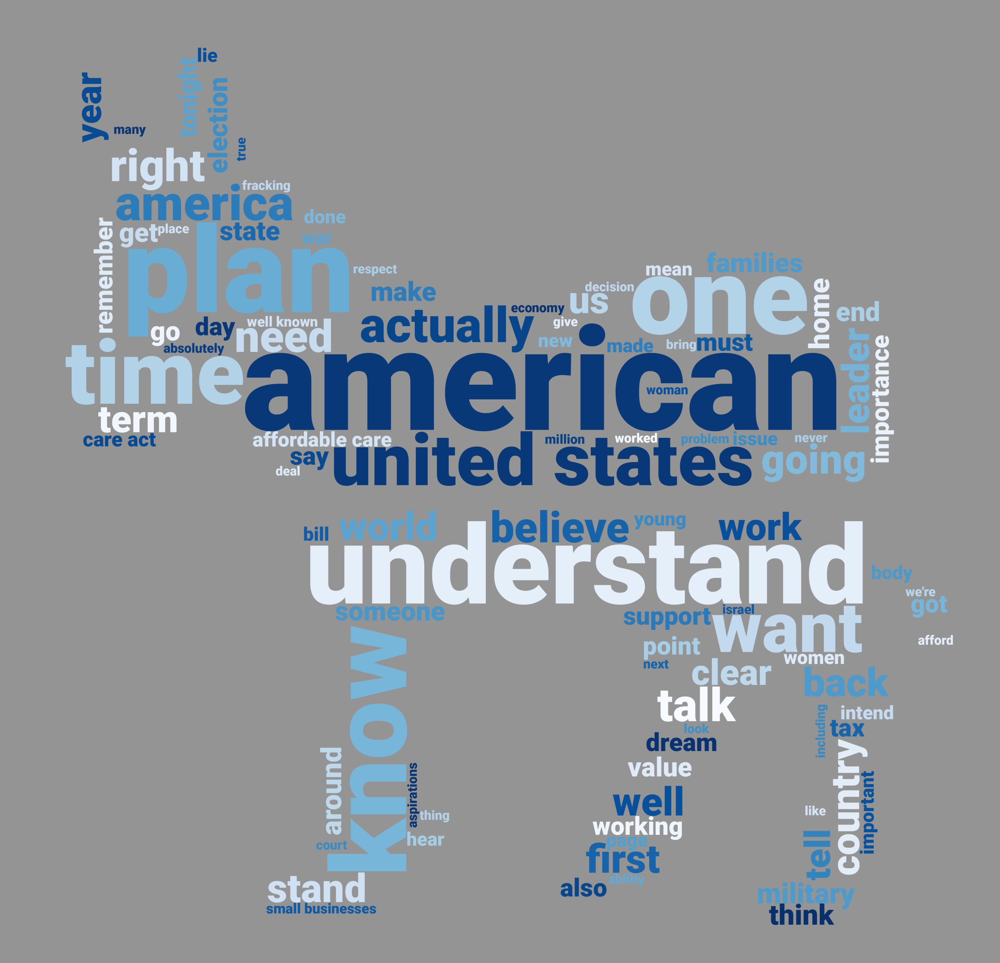
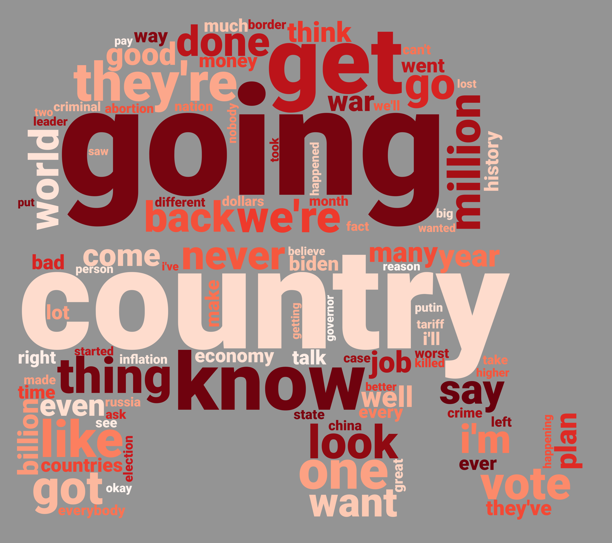
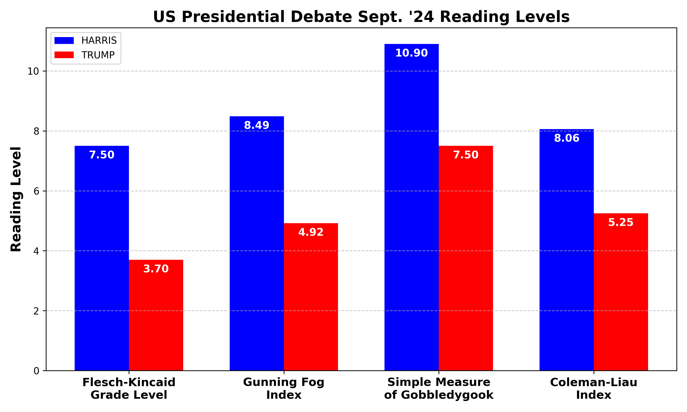

# September 10th 2024 US Presidential Debate Word Cloud

## Prerequisites

Run `pip install nltk wordcloud matplotlib textstat`

## Sources

Transcript by [The American Presidency Project](https://www.presidency.ucsb.edu/documents/presidential-debate-philadelphia-pennsylvania)

Donkey and elephant masks created from the party logos with minor blurring for smoothness and filling in the stars. Current dimensions max out at 4000 but the mask images can be scaled if a different resolution is desired.

## Methods

Import known stop words for english language and add a few custom ignore words like the names of the candidates and the word 'president' etc. to prevent the word clouds from being uninformative.

Ignore moderator conent and strip out each candidate's content, then generate 100 hi-res word clouds with varying random states.

## Usage

### WordCloud

Run `python debatecloud.py`

Change `num_clouds` to set the number of clouds to generate per candidate.

Adjust WordCloud settings like `colormap`, `background_color` and `max_words` to experiment with various possibilities.

### Reading Levels

Run `python readlvl.py`

## Notes

This repoisitory exists so anyone can verify the methods are sound and use it to create their own variants.

## Random State 0 Samples

## Reading Levels

Standard metrics provided by `textstat` library are calculated and plotted.

### Metric meanings

#### 1. Flesch-Kincaid Grade Level
- **Purpose**: Estimates the U.S. school grade level needed to understand a text.
- **How it works**: It considers the average number of words per sentence and the average number of syllables per word.
- **Formula**: `0.39 × (Total Words / Total Sentences) + 11.8 × (Total Syllables / Total Words) - 15.59`
- **Interpretation**: A higher score corresponds to a higher grade level, meaning the text is more complex.

#### 2. Gunning Fog Index
- **Purpose**: Estimates the number of years of formal education required to understand the text.
- **How it works**: It focuses on sentence length and complex words (words with three or more syllables).
- **Formula**: `0.4 × ((Total Words / Total Sentences) + (Complex Words / Total Words) × 100)`
- **Interpretation**: A Fog Index of 12 means the text requires a high school education to understand, while a higher score indicates a need for more education.

#### 3. SMOG Index (Simple Measure of Gobbledygook)
- **Purpose**: Measures readability based on the number of complex (polysyllabic) words in a text.
- **How it works**: It calculates the number of words with three or more syllables and uses this to estimate the reading level.
- **Formula** (for texts of 30 sentences or more): `1.0430 × √(Polysyllabic Words × (30 / Sentences)) + 3.1291`
- **Interpretation**: Higher scores indicate that more years of education are required to understand the text, with the focus on the presence of complex words.

#### 4. Coleman-Liau Index
- **Purpose**: Estimates the grade level required to read a text, based on characters rather than syllables or complex words.
- **How it works**: It uses the average number of characters per word and the average number of words per sentence.
- **Formula**: `0.0588 × (Characters / Words × 100) - 0.296 × (Sentences / Words × 100) - 15.8`
- **Interpretation**: A higher score indicates a more complex text, with a focus on sentence length and word length (in terms of characters).