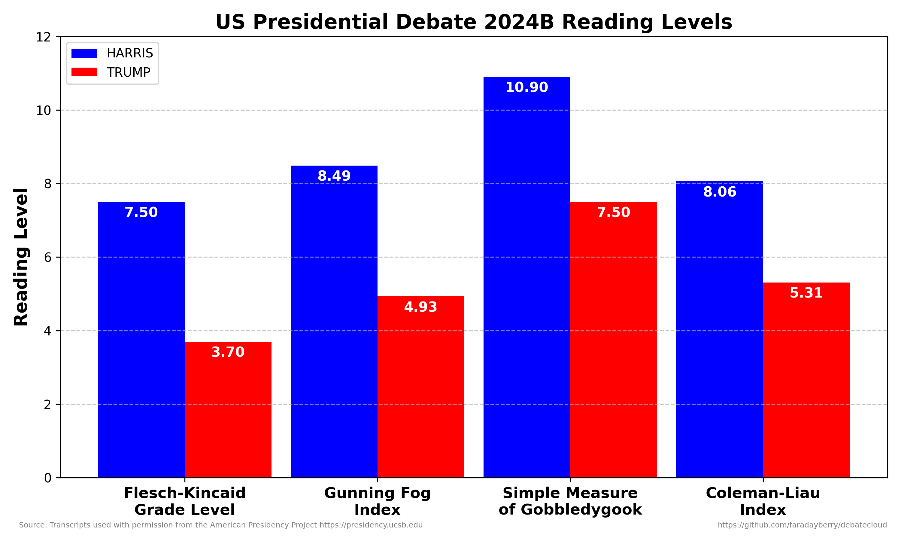
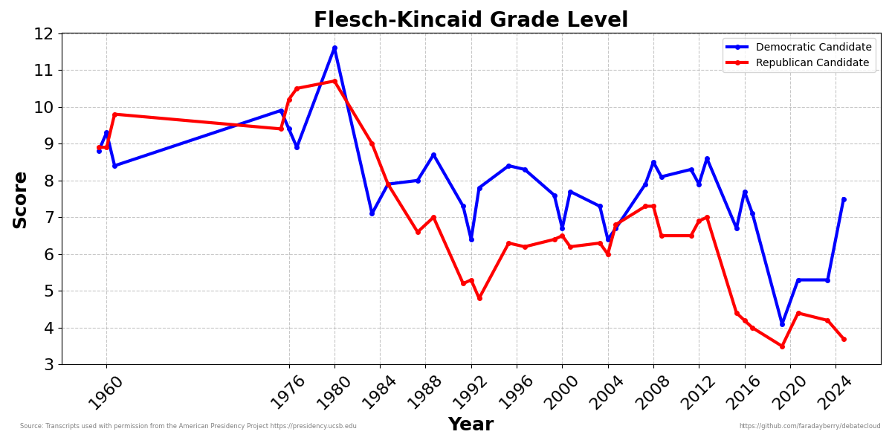
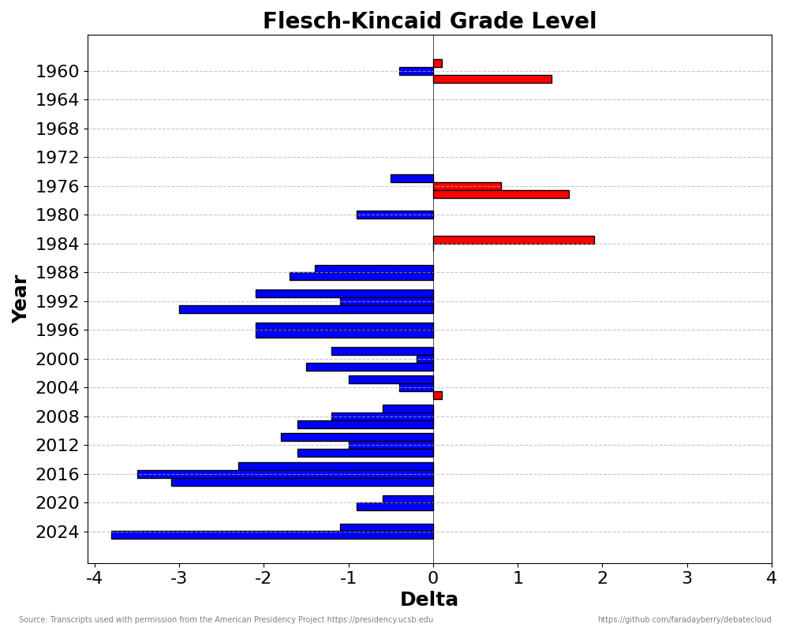

# Presidential Debate Analysis & Wordclouds

## Prerequisites

Run `pip install nltk numpy wordcloud matplotlib textstat`

## Sources

Transcripts used with permission from [The American Presidency Project](https://www.presidency.ucsb.edu/) with small updates to make the older transcripts consistent with the newer formats and replacing all moderator names with MODERATOR. If you use or enjoy this project please consider [donating to the APP](https://giving.ucsb.edu/Funds/Give?id=185).

>The American Presidency Project is the world's pre-eminent comprehensive online resource on all aspects of the U.S. presidency. This project is one of the world's most widely used sources for information about the presidency and the role of the presidency in American democracy and is cited as a source in major newspapers, radio, television, and scholarly work. Gifts to the American Presidency Project Support Fund enable the upgrade and expansion of the project, assuring that source documents and analytical data on the presidency remain the best available.

## Reading Levels

Standard metrics provided by `textstat` library are calculated and plotted.

### Metric meanings

#### 1. Flesch-Kincaid Grade Level
- **Purpose**: Estimates the U.S. school grade level needed to understand a text.
- **How it works**: It considers the average number of words per sentence and the average number of syllables per word.
- **Formula**: `0.39 × (Total Words / Total Sentences) + 11.8 × (Total Syllables / Total Words) - 15.59`
- **Interpretation**: A higher score corresponds to a higher grade level, meaning the text is more complex.

#### 2. Gunning Fog Index
- **Purpose**: Estimates the number of years of formal education required to understand the text.
- **How it works**: It focuses on sentence length and complex words (words with three or more syllables).
- **Formula**: `0.4 × ((Total Words / Total Sentences) + (Complex Words / Total Words) × 100)`
- **Interpretation**: A Fog Index of 12 means the text requires a high school education to understand, while a higher score indicates a need for more education.

#### 3. SMOG Index (Simple Measure of Gobbledygook)
- **Purpose**: Measures readability based on the number of complex (polysyllabic) words in a text.
- **How it works**: It calculates the number of words with three or more syllables and uses this to estimate the reading level.
- **Formula** (for texts of 30 sentences or more): `1.0430 × √(Polysyllabic Words × (30 / Sentences)) + 3.1291`
- **Interpretation**: Higher scores indicate that more years of education are required to understand the text, with the focus on the presence of complex words.

#### 4. Coleman-Liau Index
- **Purpose**: Estimates the grade level required to read a text, based on characters rather than syllables or complex words.
- **How it works**: It uses the average number of characters per word and the average number of words per sentence.
- **Formula**: `0.0588 × (Characters / Words × 100) - 0.296 × (Sentences / Words × 100) - 15.8`
- **Interpretation**: A higher score indicates a more complex text, with a focus on sentence length and word length (in terms of characters).

### Individual Usage
```
python3 readlvl.py --year 1960 --candidates Kennedy Nixon --colors blue red  --suffix a
python3 readlvl.py --year 1960 --candidates Kennedy Nixon --colors blue red  --suffix b
python3 readlvl.py --year 1960 --candidates Kennedy Nixon --colors blue red  --suffix c
python3 readlvl.py --year 1976 --candidates Carter Ford --colors blue red  --suffix a
python3 readlvl.py --year 1976 --candidates Carter Ford --colors blue red  --suffix b
python3 readlvl.py --year 1976 --candidates Carter Ford --colors blue red  --suffix c
python3 readlvl.py --year 1980 --candidates Carter Reagan --colors blue red
python3 readlvl.py --year 1984 --candidates Mondale Reagan --colors blue red --suffix a
python3 readlvl.py --year 1984 --candidates Mondale Reagan --colors blue red --suffix b
python3 readlvl.py --year 1988 --candidates Dukakis Bush --colors blue red --suffix a
python3 readlvl.py --year 1988 --candidates Dukakis Bush --colors blue red --suffix b
python3 readlvl.py --year 1992 --candidates Clinton Bush Perot --colors blue red green --suffix a
python3 readlvl.py --year 1992 --candidates Clinton Bush Perot --colors blue red green --suffix a
python3 readlvl.py --year 1992 --candidates Clinton Bush Perot --colors blue red green --suffix b
python3 readlvl.py --year 1992 --candidates Clinton Bush Perot --colors blue red green --suffix c
python3 readlvl.py --year 1996 --candidates Clinton Dole --colors blue red --suffix a
python3 readlvl.py --year 1996 --candidates Clinton Dole --colors blue red --suffix b
python3 readlvl.py --year 2000 --candidates Gore Bush --colors blue red --suffix c
python3 readlvl.py --year 2004 --candidates Kerry Bush --colors blue red --suffix a
python3 readlvl.py --year 2004 --candidates Kerry Bush --colors blue red --suffix b
python3 readlvl.py --year 2004 --candidates Kerry Bush --colors blue red --suffix c
python3 readlvl.py --year 2008 --candidates Obama McCain --colors blue red --suffix a
python3 readlvl.py --year 2008 --candidates Obama McCain --colors blue red --suffix b
python3 readlvl.py --year 2008 --candidates Obama McCain --colors blue red --suffix c
python3 readlvl.py --year 2012 --candidates Obama Romney --colors blue red --suffix a
python3 readlvl.py --year 2012 --candidates Obama Romney --colors blue red --suffix b
python3 readlvl.py --year 2012 --candidates Obama Romney --colors blue red --suffix c
python3 readlvl.py --year 2016 --candidates Clinton Trump --colors blue red --suffix c
python3 readlvl.py --year 2020 --candidates Biden Trump --colors blue red --suffix a
python3 readlvl.py --year 2020 --candidates Biden Trump --colors blue red --suffix b
python3 readlvl.py --year 2024 --candidates Biden Trump --colors blue red --suffix a
python3 readlvl.py --year 2024 --candidates Harris Trump --colors blue red --suffix b
```



### Plotting Trends
```
python3 collect_and_plot_readability.py
```





## Wordclouds

*This code has not been updated to reflect the addition of previous debates.*

Donkey and elephant masks created from the party logos with minor blurring for smoothness and filling in the stars. Current dimensions max out at 4000 but the mask images can be scaled if a different resolution is desired.

### Methods

Import known stop words for english language and add a few custom ignore words like the names of the candidates and the word 'president' etc. to prevent the word clouds from being uninformative.

Ignore moderator conent and strip out each candidate's content, then generate 100 hi-res word clouds with varying random states.

### Usage

Run `python debatecloud.py`

Change `num_clouds` to set the number of clouds to generate per candidate.

Adjust WordCloud settings like `colormap`, `background_color` and `max_words` to experiment with various possibilities.